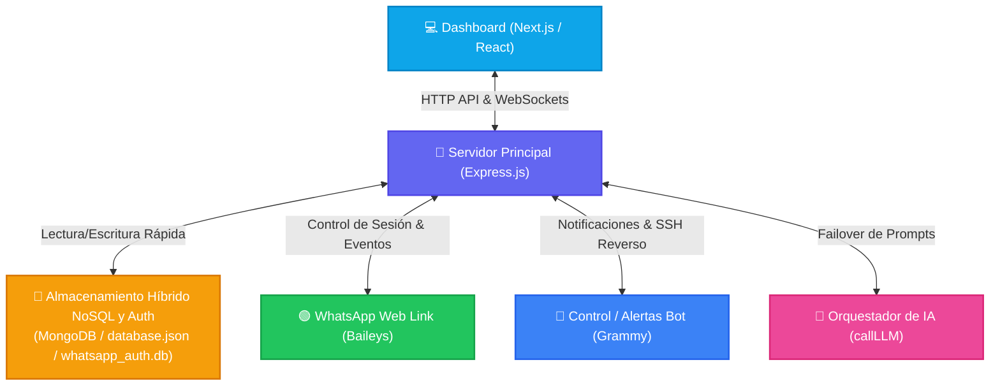
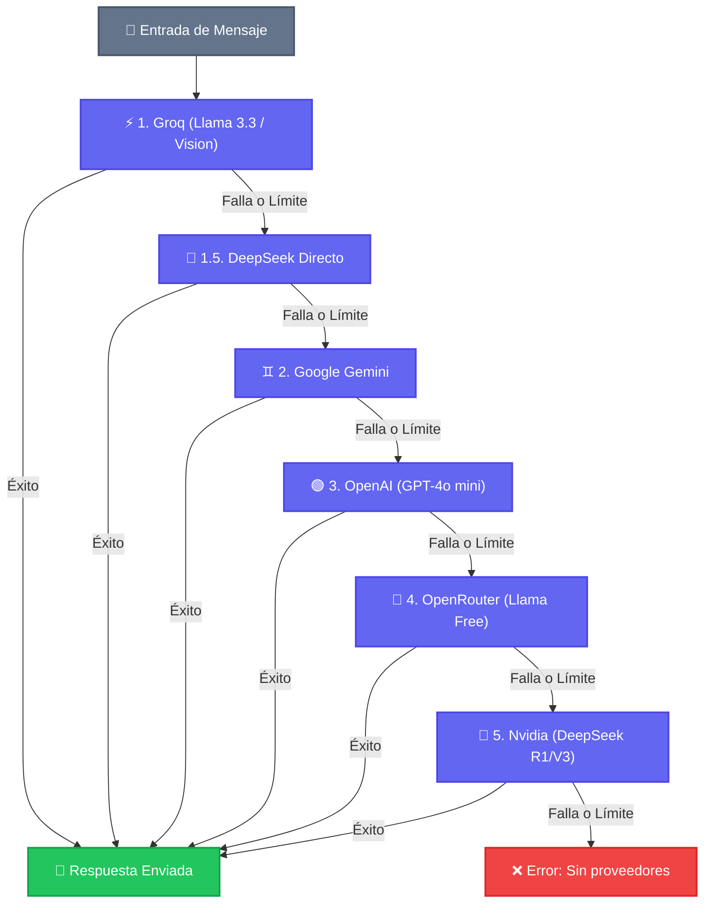

<div align="center">
  <h1>🦊 BotMaRe - Gravity Dashboard (Unified)</h1>
  <p><strong>La plataforma definitiva de automatización para WhatsApp impulsada por Inteligencia Artificial y Orquestación Multi-Proveedor.</strong></p>

  <p>
    
    
    
    
    
  </p>
</div>

---

## 📖 ¿Qué es BotMaRe?

**BotMaRe (powered by Kitsune Engine)** transforma tu cuenta de WhatsApp en una central de operaciones inteligente. Integra los modelos de IA más avanzados del mercado, flujos de automatización de mensajes, programadores de recordatorios, y un panel de administración premium con diseño *Glassmorphism*, todo consolidado en un solo proceso monolítico de alto rendimiento.

---

## 🏛️ Arquitectura y Flujo de Datos

El siguiente diagrama ilustra cómo interactúan la interfaz gráfica, el servidor central de Express, las bases de datos SQLite y las integraciones externas (WhatsApp, Telegram y Proveedores de IA):



---

## ✨ Características Principales

- 🧠 **IA Multi-Proveedor con Failover**: Groq, Gemini, OpenAI, DeepSeek, OpenRouter y Nvidia. Si un proveedor falla, la IA escala automáticamente al siguiente en milisegundos.
- 📱 **WhatsApp Agent**: Respuestas inteligentes, comprensión de imágenes (Visión), transcripción de audio (Whisper) y soporte de documentos.
- 📢 **Difusión Masiva**: Envía campañas personalizadas a listas de contactos desde la interfaz sin riesgo de bloqueos. ¡Soporta múltiples archivos multimedia adjuntos!
- ⚡ **Menús Rápidos**: Auto-respuestas por palabras clave con inyección de contexto de IA, menús de flujo e ignorado automático de chats.
- 📅 **Recordatorios Inteligentes**: Programa recordatorios en chats privados o grupales con frecuencias de repetición personalizadas.
- 🛡️ **Centro de Soporte Humano**: Detén la IA en cualquier chat de forma temporal si un cliente requiere atención humana. Centraliza las alertas en Telegram.
- 📦 **Respaldos en un Clic**: Exporta e importa bases de datos de configuración y archivos multimedia por separado o juntos desde la UI.
- ✈️ **Soporte Remoto vía Telegram**: Controla el estado del bot, genera nuevos QRs y levanta túneles de soporte SSH remoto (`tmate`) directo desde tu chat de Telegram.
- 👥 **Gestor de Grupos**: Selector nativo de grupos autorizados en el dashboard y detección inteligente de menciones.
- 💾 **Base de Datos Híbrida Inteligente**: Conexión prioritaria a MongoDB Atlas en la nube con un fallback automático y resiliente a una base de datos local `lowdb` (`data/database.json`) si se produce un fallo de red o un timeout de 5 segundos.
- 📶 **Control de Conectividad**: Tarjeta visual en el panel de configuración para ver el estado y copiar con un clic tus accesos por **Cloudflare Tunnel** (Público) y **Tailscale VPN** (Privado).
- 📡 **IP Auto-Detección**: Filtra automáticamente adaptadores de bucle o redes virtuales incompatibles (como WARP) para mostrar tu dirección IP física real de Wi-Fi o Ethernet.
- 🛠️ **Consola de Control Maestro**: Un lanzador interactivo multiplataforma (`pnpm run menu`) para iniciar, compilar, limpiar logs o reiniciar WhatsApp de forma completamente visual.

---

## 🧠 Orquestador de IA y Failover Automático

La función `callLLM` actúa como un despachador inteligente. Si una API Key se queda sin saldo o el servidor de un proveedor sufre un límite de peticiones (Error 429), el orquestador fluye de manera descendente para asegurar que el bot nunca deje de responder:



---

## 🚀 Guías de Instalación Paso a Paso

### 💻 Opción A: Servidor Local (Windows / macOS / Linux)

Ideal para computadoras de escritorio de uso diario o laptops locales.

#### Requisitos Previos:
- **Node.js**: v18 o superior ([Descargar](https://nodejs.org/)).
- **pnpm**: Gestor de paquetes ultrarrápido. Instálalo abriendo tu terminal y ejecutando:
  ```bash
  npm install -g pnpm
  ```

#### Paso a Paso:

1. **Clona el repositorio oficial de GitHub:**
   ```bash
   git clone https://github.com/LedezmaSune/BotMaRe.git
   cd BotMaRe
   ```

2. **Prepara tu archivo de variables de entorno:**
   * **En Windows (CMD/PowerShell):**
     ```powershell
     copy .env.example .env
     ```
   * **En Linux o macOS:**
     ```bash
     cp .env.example .env
     ```

3. **Instala todas las dependencias del proyecto:**
   ```bash
   pnpm install
   ```

4. **Compila la interfaz de Next.js para producción:**
   ```bash
   pnpm run build
   ```

5. **Inicia el menú interactivo para controlar tu bot de forma visual:**
   ```bash
   pnpm run menu
   ```
   *Selecciona la opción **1** para iniciar en Modo Producción. Tu consola mostrará las direcciones locales, privadas e IPs físicas para acceder al Dashboard (por defecto: `http://localhost:8000`). Accede con tu usuario (`admin`) y contraseña (`admin123`).*

---

### ☁️ Opción B: Servidor en la Nube (VPS Linux Ubuntu/Debian)

Ideal para mantener el bot operativo 24 horas al día, 7 días a la semana sin depender de tu computadora personal.

#### Requisitos de Hardware mínimos:
- **CPU**: 1 vCPU o superior.
- **RAM**: 1 GB mínimo. **IMPORTANTE:** Si tu VPS tiene solo 1 GB de RAM, la compilación del frontend puede quedarse sin memoria. Activa la memoria virtual (Swap) cuando el instalador te lo pregunte.

#### Instalación en Un Solo Paso (Script Automático):
Conéctate a tu VPS mediante SSH y ejecuta este comando maestro:
```bash
curl -fsSL https://raw.githubusercontent.com/LedezmaSune/BotMaRe/main/install.sh | bash
```
*Este instalador actualizará tu sistema operativo, instalará Node.js, pnpm, PM2, clonará el proyecto, creará la memoria Swap y dejará el bot compilado y listo para iniciar.*

#### Gestión en Segundo Plano con PM2:
* **Iniciar el Bot 24/7:**
  ```bash
  pnpm run pm2:start
  ```
* **Monitorear Consola en Vivo:**
  ```bash
  pnpm run pm2:logs
  ```
* **Guardar persistencia ante reinicios del VPS:**
  ```bash
  pm2 save
  pm2 startup
  ```

---

### 📱 Opción C: Dispositivos Móviles (Android con Termux)

¡Corre el bot completo directamente desde tu celular, sin computadoras ni VPS! El instalador está optimizado para compilar SQLite nativo y resolver el túnel de Cloudflare en entornos móviles de forma automática.

#### Requisitos Previos:
- Android 7.0 o superior.
- Instalar la terminal **Termux** desde [F-Droid](https://f-droid.org/packages/com.termux/) (la versión de Google Play está obsoleta y causará errores de paquetes).
- Asegúrate de tener al menos 3 GB de memoria interna libre.
- Desactiva la optimización de batería para la aplicación Termux en los ajustes de tu Android (evita que el sistema lo cierre en segundo plano).

> [!WARNING]
> **REGLA DE ORO DE TERMUX:** Jamás instales ni clones este repositorio dentro del almacenamiento compartido (`/sdcard` o `/storage/emulated/0/...`). Las políticas de seguridad de Android montan esta partición con `noexec`, lo que impedirá la compilación de SQLite y el arranque de Node.js. **Instala siempre en el almacenamiento interno protegido del usuario (`~/` o `$HOME`)**.

#### Instalación Automática (Script Móvil):
El script de Termux valida la ruta de almacenamiento, instala automáticamente Node.js LTS, herramientas de compilación C++, Cloudflared aarch64 y compila SQLite de forma resiliente. Abre Termux y ejecuta:
```bash
curl -fsSL https://raw.githubusercontent.com/LedezmaSune/BotMaRe/main/install-termux.sh | bash
```

#### Instalación Manual (Paso a Paso):
Si deseas compilar todo de forma imperativa y manual, sigue estos pasos:

1. **Prepara tu entorno seguro e instala dependencias (Node LTS es altamente recomendado):**
   ```bash
   cd $HOME
   pkg update && pkg upgrade -y
   pkg install nodejs-lts python make clang binutils sqlite git curl openssl tmate tailscale -y
   ```
2. **Instala los gestores de paquetes globales:**
   ```bash
   npm install -g pnpm pm2
   ```
3. **Clona el repositorio en el HOME interno:**
   ```bash
   git clone https://github.com/LedezmaSune/BotMaRe.git
   cd BotMaRe
   cp .env.example .env
   ```
4. **Configura el entorno de compilación C++ de Android y compila SQLite:**
   ```bash
   export CC=clang
   export CXX=clang++
   export LINK=clang++
   export GYP_DEFINES="OS=android"
   export npm_config_build_from_source=true
   export npm_config_sqlite="/data/data/com.termux/files/usr"
   
   # Compilar nativo better-sqlite3 de forma aislada
   npm install better-sqlite3 --build-from-source --sqlite="/data/data/com.termux/files/usr" --unsafe-perm
   ```
5. **Instala el resto de dependencias y compila la interfaz del Dashboard:**
   ```bash
   pnpm install
   pnpm run build
   ```
6. **Arranca el Bot:**
   ```bash
   pnpm start
   ```

---

## 📶 Gestión de Redes y Conectividad

BotMaRe te ofrece tres formas perfectamente integradas para ver y compartir el panel de control:

1. **🌐 RED LOCAL (Wi-Fi/Ethernet):**
   * **¿Qué es?** La dirección IP física de tu computadora en tu módem (ej: `http://10.31.17.53:8000`).
   * **¿Para qué sirve?** Para abrir el panel desde cualquier celular, tableta o laptop que esté conectada al mismo Wi-Fi de tu casa u oficina.
2. **🔒 RED PRIVADA (Tailscale VPN):**
   * **¿Qué es?** Una VPN privada y segura autogestionada (IP que inicia en `100.x.x.x`).
   * **¿Para qué sirve?** Conéctate a tu panel desde cualquier lugar del mundo de manera 100% encriptada. El bot detectará tu IP de Tailscale y te la mostrará en el dashboard con un botón de copiado rápido.
3. **🌍 RED PÚBLICA (Cloudflare Tunnel):**
   * **¿Qué es?** Un túnel seguro de Cloudflare (`https://tu-subdominio.trycloudflare.com`).
   * **¿Para qué sirve?** Te da una URL pública segura (`https://`) para compartir con tu equipo o acceder desde cualquier navegador del mundo sin necesidad de abrir puertos en tu módem.

---

## 🧹 Mantenimiento del Servidor y Optimización

Los registros de chat y logs de Baileys pueden llenar tu disco. Mantén el sistema ligero con un solo comando:

```bash
pnpm run clean:logs
```
* **¿Qué hace?** Elimina logs antiguos, trunca archivos bloqueados por PM2 y ejecuta una desfragmentación física en tus bases de datos SQLite (`VACUUM`) para reclamar espacio en disco inmediatamente.

---

## 🏷️ Variables Dinámicas para Plantillas y Difusión

Personaliza tus mensajes de difusión y auto-respuestas inyectando datos del destinatario:

| Variable | Descripción | Ejemplo Visual |
|---|---|---|
| `{NOMBRE}` | Nombre completo guardado en agenda | Juan Carlos Pérez |
| `{NOMBRE_PILA}` | Primer nombre únicamente | Juan |
| `{APELLIDO}` | Apellidos únicamente | Pérez |
| `{FECHA}` | Fecha actual del servidor | 25/05/2026 |
| `{HORA_12}` | Hora actual en formato de 12 horas | 3:45 PM |
| `{HORA_24}` | Hora actual en formato de 24 horas | 15:45 |
| `{DIA_SEMANA}` | Día de la semana en curso | Lunes |

---

## 📜 Tabla de Scripts Disponibles

| Comando | Descripción |
|---|---|
| `pnpm run menu` | **Lanzador Interactivo:** Menú gráfico para controlar todas las funciones. |
| `pnpm run dev` | Inicia el motor y Next.js en modo desarrollo con recarga activa. |
| `pnpm run build` | Compila las páginas estáticas del Dashboard para producción. |
| `pnpm run start` | Arranca el bot y sirve el dashboard compilado en modo producción. |
| `pnpm run clean` | Elimina todas las carpetas de caché `.next`, `.dist` y `out/`. |
| `pnpm run clean:logs` | Vacía logs en ejecución y optimiza el almacenamiento de SQLite. |
| `pnpm run reset:wa` | Elimina sesión actual de WhatsApp para forzar un escaneo de QR nuevo. |
| `pnpm run pm2:start` | Despliega e inicia el bot 24/7 en segundo plano usando PM2. |
| `pnpm run pm2:logs` | Abre el visor de consola en tiempo real para PM2. |

---

## 💾 Sistema de Base de Datos Híbrida Unificada (MongoDB Atlas / Lowdb)

Toda la persistencia de datos de la plataforma (**recordatorios, plantillas, auto-respuestas, historial de chats, auditorías, configuraciones del panel y perfiles de usuarios**) ha sido completamente migrada a una arquitectura NoSQL híbrida unificada (`src/core/dbManager.ts`):

1. **Prioridad en la Nube (MongoDB Atlas - Plan A):** Si configuras `MONGO_URI` en tu archivo `.env`, el bot almacenará todos los datos de forma centralizada y segura en la nube.
2. **Fallback Local Resiliente (Lowdb - Plan B):** Si la conexión a MongoDB Atlas falla (por timeout de 5 segundos), no hay acceso a internet o la variable de entorno no está configurada, el bot conmuta en tiempo real de forma automática para guardar y leer los datos localmente en [data/database.json](file:///c:/Proyectos/wamasivos/BotMaRe-main/data/database.json).

### 🤖 Migración Automática Cero-Pérdidas
El bot cuenta con un script de migración nativo (`src/core/migrator.ts`). Al arrancar la plataforma por primera vez, detectará si cuentas con una base de datos física de SQLite previa (`data/database.db`), extraerá todos tus datos reales de forma segura y los importará con sus IDs originales al nuevo motor NoSQL activo, registrando el éxito en `data/database.db.migrated` sin alterar tu archivo original.

---


<div align="center">
  <p>Desarrollado con ❤️ por <strong><a href="https://github.com/LedezmaSune">LedezmaSune</a></strong></p>
  <p>Impulsado por <strong>Kitsune Engine</strong> 🦊</p>
</div>
