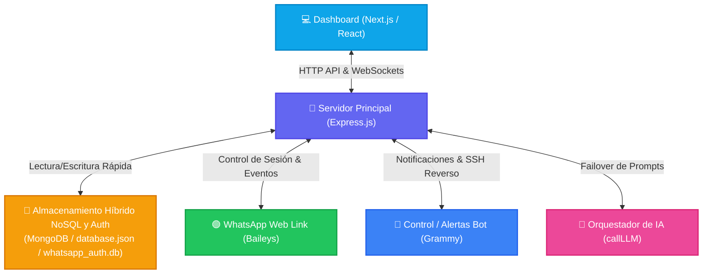
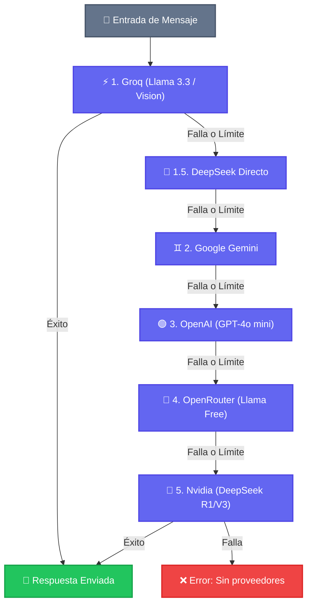

<div align="center">
  <h1>🦊 BotMaRe - Gravity Dashboard (Unified)</h1>
  <p><strong>La plataforma definitiva de automatización para WhatsApp impulsada por Inteligencia Artificial y Orquestación Multi-Proveedor.</strong></p>

  <p>
    
    
    
    
    
  </p>
</div>

---

## 📑 Tabla de Contenidos

1. [¿Qué es BotMaRe?](#-qué-es-botmare)
2. [Arquitectura y Flujo de Datos](#-arquitectura-y-flujo-de-datos)
3. [Características Principales](#-características-principales)
4. [Manual de Usuario (Dashboard y Funciones)](#-manual-de-usuario-dashboard-y-funciones)
   - [El Asistente Inteligente (Carga Masiva)](#el-asistente-inteligente-carga-masiva)
   - [Difusiones y el Motor Spintax](#difusiones-y-el-motor-spintax)
   - [Cerebro IA, Personalidad y Variables Dinámicas](#cerebro-ia-personalidad-y-variables-dinámicas)
   - [Blindaje Anti-Ban Activo](#blindaje-anti-ban-activo-transmisión-segura)
   - [Grupos y Auditoría](#grupos-y-auditoría)
   - [Sincronización con Google Sheets](#sincronización-con-google-sheets-autorespondedores)
5. [Modelos de IA y Orquestación](#-orquestador-de-ia-y-failover-automático)
6. [Guía de Instalación y Despliegue](#-guías-de-instalación-paso-a-paso)
   - [Instalación Automática (Recomendada)](#instalación-automática-para-clientes-recomendado)
   - [Compilación Manual (Sin Docker)](#compilación-manual-sin-docker)
   - [Dispositivos Móviles (Termux Android)](#dispositivos-móviles-android-con-termux)
   - [Despliegue Automatizado (CI/CD)](#despliegue-automatizado-cicd-con-github-actions)
7. [Gestión Avanzada y Mantenimiento](#-gestión-avanzada-con-pm2)
   - [Comandos de Emergencia](#comandos-de-emergencia-windows)
   - [Mantenimiento y Optimización](#mantenimiento-del-servidor-y-optimización)
   - [Troubleshooting](#-solución-a-errores-comunes-de-instalación-troubleshooting)
8. [Redes y Conectividad](#-gestión-de-redes-y-conectividad)
9. [Base de Datos](#-sistema-de-base-de-datos-híbrida-unificada-mongodb-atlas--lowdb)
10. [Historial de Actualizaciones (Changelog)](#-historial-de-actualizaciones-changelog)

---

## 📖 ¿Qué es BotMaRe?

**BotMaRe (powered by Kitsune Engine)** transforma tu cuenta de WhatsApp en una central de operaciones inteligente. Integra los modelos de IA más avanzados del mercado, flujos de automatización de mensajes, programadores de recordatorios, y un panel de administración premium con diseño *Glassmorphism*, todo consolidado en un solo proceso monolítico de alto rendimiento.

---

## 🏛️ Arquitectura y Flujo de Datos

El siguiente diagrama ilustra cómo interactúan la interfaz gráfica, el servidor central de Express, las bases de datos SQLite y las integraciones externas (WhatsApp, Telegram y Proveedores de IA):



---

## ✨ Características Principales

- 🧠 **IA Multi-Proveedor con Failover**: Groq, Gemini, OpenAI, DeepSeek, OpenRouter y Nvidia. Si un proveedor falla, la IA escala automáticamente al siguiente en milisegundos.
- 📱 **WhatsApp Agent**: Respuestas inteligentes, comprensión de imágenes (Visión), transcripción de audio (Whisper) y soporte de documentos.
- 📢 **Difusión Masiva con Spintax**: Envía campañas personalizadas a listas de contactos desde la interfaz con soporte nativo de **Giro de Texto (Spintax)**.
- ⚡ **Menús Rápidos e IA**: Auto-respuestas por palabras clave con soporte de variables dinámicas e inyección de contexto de IA.
- 📅 **Recordatorios Inteligentes**: Programa recordatorios en chats privados o grupales con frecuencias de repetición y soporte de carga masiva.
- 🛡️ **Blindaje Anti-Ban Activo**: Retardos aleatorios proporcionalmente dinámicos, pausas de seguridad y simulación humana de carga de archivos ("Escribiendo..." y "Grabando audio...").
- 👤 **Soporte Humano Dinámico**: Detén la IA en cualquier chat de forma temporal. Centraliza alertas en Telegram.
- 📦 **Respaldos en un Clic**: Exporta e importa bases de datos de configuración y multimedia.
- ✈️ **Soporte Remoto vía Telegram**: Controla el estado del bot, genera nuevos QRs y levanta túneles de soporte SSH remoto directo desde Telegram.

---

## 📘 Manual de Usuario (Dashboard y Funciones)

Este apartado está diseñado para capacitarte en el uso avanzado de la plataforma desde tu panel web.

### El Asistente Inteligente (Carga Masiva)
La joya de la corona para ahorrar horas de trabajo manual. Si necesitas enviar decenas de archivos multimedia programados a diferentes fechas, este módulo lo hace por ti.

**¿Cómo Funciona?**
1. Ve a la pestaña de **Recordatorios / Programación** y haz clic en **Carga Masiva**.
2. **Configura la Campaña Global:**
   - Selecciona el grupo o contacto destinatario.
   - Decide a qué hora del día (por ejemplo, `09:00 AM`) se enviará.
   - Usa la variable mágica `{ARCHIVO}` en el mensaje (ej: *"Aquí tienes el reporte: {ARCHIVO}"*).
3. **Magia en el Nombre del Archivo:** Nombra tus archivos con la fecha deseada (ej. `1105.jpg` para el 11 de Mayo, o `11-05-2026.jpg`).
4. **Sube y Relájate:** El sistema procesará todos los archivos, agendándolos ordenadamente en tu panel de *Pendientes*.

### Difusiones y el Motor Spintax
Para evitar baneos al enviar el mismo mensaje a cientos de personas, BotMaRe incluye un **Motor de Spintax** nativo. Permite agrupar variaciones dentro de llaves `{}` separadas por `|`. El bot seleccionará aleatoriamente una opción.
* Ejemplo: `{Hola|Qué tal} {NOMBRE}, {Te escribo|Nos comunicamos} para...`

**Botones de IA en Campañas:**
- **Perfeccionar con IA:** Corrige ortografía y mejora la redacción.
- **Generar Spintax (Púrpura):** Reescribe el mensaje usando Spintax avanzado y emojis temáticos específicos de tu sector. Puedes proteger partes específicas usando llaves `{nuestra promoción}` para que la IA no las altere.

### Cerebro IA, Personalidad y Variables Dinámicas
En la pestaña **Configuración del Agente**, controlas cómo piensa el bot.
* **IA ON (Verde):** El bot responde automáticamente a los clientes según el Cerebro IA.
* **IA OFF (Naranja):** El bot "se duerme". Usa este modo cuando un humano necesite intervenir.

**Variables Mágicas:**
| Variable | Descripción |
|---|---|
| `{NOMBRE}` | Nombre completo guardado en agenda |
| `{NOMBRE_PILA}` o `{FIRST_NAME}` | Primer nombre únicamente |
| `{SALUDO}` | Saludo automático según hora (Buenos días/tardes/noches) |
| `{EMOJI_SALUDO}` / `{EMOJI_ATENCION}` / `{EMOJI_ALEATORIO}` | Emojis variados para evitar detección de spam |
| `{HORA_12}` / `{HORA_24}` | Hora actual del servidor |
| `{DIA_SEMANA}` / `{FECHA}` | Día y fecha actuales |
| `{NUMERO_ALEATORIO}` | Número aleatorio para forzar diferencias |

### Blindaje Anti-Ban Activo (Transmisión Segura)
BotMaRe protege tu cuenta mediante:
1. **Simulación de Escritura y Grabación:** Muestra "Escribiendo..." o "Grabando audio..." proporcionalmente al peso o longitud del mensaje.
2. **Retardos Caóticos Proporcionales (Jitter):** Calcula pausas basadas en la longitud de caracteres.
3. **Burst Protection:** Cada 10 envíos masivos, realiza una pausa larga (15-25s) imitando un descanso humano.

### Grupos y Auditoría
- **Grupos:** Visualiza grupos y copia sus "ID Internos" de WhatsApp.
- **Historial:** Revisa multimedia entregada con éxito.
- **Auditoría (Logs):** Diagnostica exactamente a qué hora y por qué ocurrió un evento técnico.

### Sincronización con Google Sheets (Autorespondedores)
Usa Google Sheets como base de datos externa para respuestas rápidas.
1. **Columna A:** Palabra Clave.
2. **Columna B:** Respuesta.
3. **Columna C:** Tipo de Coincidencia (`1` para Exacta, `2` para Parcial).
Puedes forzar la sincronización en el dashboard web o tocando **📊 Google Sheets** en el bot de Telegram.

---

## 🧠 Orquestador de IA y Failover Automático

La función `callLLM` actúa como despachador. Si una API falla (ej. Error 429), fluye hacia el siguiente proveedor para asegurar respuestas continuas:



**Modelos Recomendados (Bajo Costo/Gratis):**
```env
GROQ_MODEL="llama-3.1-70b-versatile"
OPENROUTER_MODEL="google/gemma-2-9b-it:free"
GEMINI_MODEL="gemini-2.5-flash"
DEEPSEEK_MODEL="deepseek-chat"
OPENAI_MODEL="gpt-4o-mini"
NVIDIA_MODEL="deepseek-ai/deepseek-v4-pro"
```

---

## 🚀 Guías de Instalación Paso a Paso

### 💻 Instalación Automática para Clientes (Recomendado)
Requiere [Docker Desktop](https://www.docker.com/products/docker-desktop/).
*Windows:*
```powershell
mkdir BotMaRe; cd BotMaRe
Invoke-WebRequest -Uri "https://raw.githubusercontent.com/LedezmaSune/BotMaRe/main/ejemplo_cliente/docker-compose.yml" -OutFile "docker-compose.yml"
Invoke-WebRequest -Uri "https://raw.githubusercontent.com/LedezmaSune/BotMaRe/main/.env.example" -OutFile ".env"
```
*Mac/Linux:*
```bash
mkdir BotMaRe; cd BotMaRe
curl -O https://raw.githubusercontent.com/LedezmaSune/BotMaRe/main/ejemplo_cliente/docker-compose.yml
curl -o .env https://raw.githubusercontent.com/LedezmaSune/BotMaRe/main/.env.example
```
1. Edita el `.env` con tu propia contraseña.
2. Ejecuta: `docker compose up -d`
3. Entra a `http://localhost:8000`

### 💻 Compilación Manual (Sin Docker)
**Opción A: Servidor Local en Windows**
1. Instala Node.js (v20+ LTS), Git y pnpm (`npm install -g pnpm`).
2. Clona el repo: `git clone https://github.com/LedezmaSune/BotMaRe.git`
3. Ejecuta `install-windows.bat`.
4. Inicia con `START.bat` (Opción 1) o `pnpm run dev`.

**Opción B: macOS / Linux / VPS**
```bash
# Para VPS Ubuntu/Debian puedes usar el autoinstalador:
curl -fsSL https://raw.githubusercontent.com/LedezmaSune/BotMaRe/main/install.sh | bash

# Manual:
git clone https://github.com/LedezmaSune/BotMaRe.git
cd BotMaRe
cp .env.example .env
pnpm install
pnpm run build
./start.sh
```

### 📱 Dispositivos Móviles (Android con Termux)
Puedes correr el bot completo directamente desde tu celular.
**Requisitos:** Android 7.0+, Termux (desde F-Droid), 3GB libres, sin optimización de batería.
> [!WARNING]
> Jamás instales en `/sdcard` o `/storage/emulated/0/`. Usa siempre el `$HOME`.

Ejecuta el script automático en Termux:
```bash
curl -fsSL https://raw.githubusercontent.com/LedezmaSune/BotMaRe/main/install-termux.sh | bash
```

### 🐳 Despliegue Automatizado (CI/CD con GitHub Actions)
Al hacer `git push` a `main`, GitHub Actions compila automáticamente tu imagen de Docker y la publica en GitHub Container Registry (`ghcr.io`).

---

## 🛠️ Gestión Avanzada con PM2

Mantén el bot 24/7 en segundo plano de forma nativa.
* **Preparación:** `npm run setup`
* **Iniciar / Reiniciar:** `pnpm run pm2:start` o `pm2 restart BotMaRe-Unified`
* **Ver Logs:** `pnpm run pm2:logs`
* **Monitor Visual:** `pnpm run pm2:monit`
* **Detener / Limpiar:** `pnpm run pm2:stop` o `pm2 delete BotMaRe-Unified`

### Comandos de Emergencia (Windows)
Si el puerto queda bloqueado (Ej. 8000):
```cmd
pm2 kill
for /f "tokens=5" %a in ('netstat -aon ^| findstr :8000') do taskkill /f /pid %a
```

### Mantenimiento del Servidor y Optimización
Limpia logs pesados y optimiza la base de datos (Vacuum):
```bash
pnpm run clean:logs
```

---

## ⚠️ Solución a Errores Comunes de Instalación (Troubleshooting)

- **Error de Base de Datos (`Could not locate the bindings file`):** 
  PNPM v10+ bloquea la compilación de `better-sqlite3`. Usa: `pnpm rebuild better-sqlite3`.
- **cloudflared no está instalado:** 
  Forzar reconstrucción: `pnpm rebuild cloudflared`.

*(Para más detalles, consulta el archivo [TROUBLESHOOTING.md](./TROUBLESHOOTING.md))*

---

## 📶 Gestión de Redes y Conectividad

1. **🌐 RED LOCAL (Wi-Fi/Ethernet):** IP de tu módem (`http://xxx.xxx.xxx.xxx:8000`).
2. **🔒 RED PRIVADA (Tailscale VPN):** Conexión segura global autogestionada (IP `100.x.x.x`). El panel muestra un botón para copiarla.
3. **🌍 RED PÚBLICA (Cloudflare Tunnel):** URL segura en internet sin abrir puertos (`https://tu-subdominio.trycloudflare.com`).

---

## 💾 Sistema de Base de Datos Híbrida Unificada (MongoDB Atlas / Lowdb)

1. **Prioridad Nube (MongoDB Atlas):** Si configuras `MONGO_URI` en `.env`, todo se guarda en Atlas.
2. **Fallback Local (Lowdb):** Si la nube falla, el sistema conmuta automáticamente a guardar en `data/database.json`.
3. **Migración Automática:** El sistema transfiere datos de tus SQLite viejos a MongoDB en el primer inicio sin pérdida de datos.

---

## 🔄 Historial de Actualizaciones (Changelog)

### [1.5.6] - 2026-06-18
* **Fix PNPM v10:** Solución a bloqueo `better-sqlite3` en `package.json`.
* **Instaladores Mágicos:** `install-windows.bat` e `install-termux.sh`.
* **Reparación Túneles:** Arreglos de rutas de Cloudflared en Windows.

### [1.5.0] - 2026-06-14
* **Rediseño de Terminal CLI:** Interfaz gráfica ANSI en la consola (`launcher.js`).
* **Mejoras Sheets:** Sincronización avanzada de 3 columnas (Exacta/Parcial).

*(Ver historial completo en commits)*

---

<div align="center">
  <p>Desarrollado con ❤️ por <strong><a href="https://github.com/LedezmaSune">LedezmaSune</a></strong></p>
  <p>Impulsado por <strong>Kitsune Engine</strong> 🦊</p>
</div>
