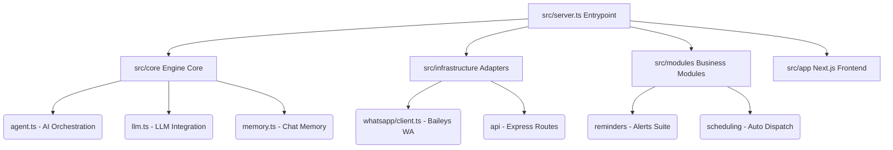

# 🦊 BotMaRe AI - Ecosistema Modular Avanzado de WhatsApp 🚀

¡Bienvenido a la documentación de **BotMaRe AI 2026**! Esta es la plataforma definitiva diseñada para transformar tu WhatsApp en un centro de operaciones inteligente, altamente portátil y con rendimiento de grado empresarial.

El sistema ha sido estructurado bajo una arquitectura de **Monolito Modular** limpia y eficiente. Cuenta con un robusto motor backend desarrollado en Node.js/Express y una interfaz moderna (Dashboard) construida con **Next.js 16 (React 19)** y animaciones de `framer-motion`, lista para ejecutarse 24/7 de manera ininterrumpida.

---

## ⚡ Instalación Exprés (Una sola línea)

Pega este comando en la terminal de tu servidor Linux o macOS y **todo se instala automáticamente**:

```bash
curl -fsSL https://raw.githubusercontent.com/LedezmaSune/BotMaRe/main/install.sh | bash
```

> [!TIP]
> Este comando clona el repositorio, instala Node.js (si falta), instala las dependencias, crea tu archivo `.env`, configura Swap en VPS pequeños y compila el Dashboard. **Cero interacción requerida.**

Después de la instalación, solo necesitas configurar tus claves:
```bash
cd BotMaRe
nano .env              # Configura tus API Keys de IA
pnpm run pm2:start     # Inicia en producción 24/7
```

---

## 📋 Requisitos Previos

| Requisito | Versión Mínima | Notas |
|---|---|---|
| **Node.js** | v20 LTS | [Descargar](https://nodejs.org/) — El instalador lo instala automáticamente |
| **Git** | Cualquiera | [Descargar](https://git-scm.com/) — Requerido para clonar y actualizar |
| **pnpm** | v9+ | Se instala automáticamente con el instalador |
| **PM2** | v5+ | Se instala automáticamente — Gestor de procesos para producción |

---

## 🚀 Guía de Instalación Detallada (Paso a Paso)

Si prefieres tener control total del proceso o estás en **Windows**, sigue esta guía manual:

### 🐧 Linux / macOS (Interactivo)

```bash
# 1. Clonar el repositorio
git clone https://github.com/LedezmaSune/BotMaRe.git
cd BotMaRe

# 2. Ejecutar el instalador maestro (interactivo, con preguntas)
chmod +x install.sh
./install.sh
```

El instalador te guiará paso a paso: verificará dependencias, instalará paquetes, configurará el `.env` con tu puerto preferido, ofrecerá crear Swap si tu VPS tiene poca RAM, compilará el Dashboard y te dará la opción de arrancar inmediatamente.

### 🪟 Windows (CMD / PowerShell)

```bash
# 1. Clonar el repositorio
git clone https://github.com/LedezmaSune/BotMaRe.git
cd BotMaRe

# 2. Ejecutar el instalador visual de Windows
bin\setup.bat
```

> [!NOTE]
> En Windows también puedes usar `bin\manager.bat` que incluye un panel de control completo con menú interactivo para desarrollo, producción, mantenimiento y más.

### 🔧 Instalación Manual Universal

Si prefieres hacerlo todo a mano en cualquier sistema operativo:

```bash
# 1. Clonar e ingresar al proyecto
git clone https://github.com/LedezmaSune/BotMaRe.git
cd BotMaRe

# 2. Instalar dependencias
npm install -g pnpm pm2
pnpm config set ignore-scripts false
pnpm install

# 3. Crear archivo de configuración
cp .env.example .env    # Linux/macOS
copy .env.example .env  # Windows CMD

# 4. Editar .env con tus claves de IA
nano .env               # o usa tu editor preferido

# 5. Compilar la interfaz
pnpm run build

# 6. Iniciar
pnpm run pm2:start
```

---

## ⚙️ Configuración del Archivo `.env`

Al crear tu archivo `.env` desde la plantilla, debes configurar como mínimo:

```env
# ── SEGURIDAD DEL DASHBOARD ─────────────────────────────
DASHBOARD_USER=tu_usuario
DASHBOARD_PASS=tu_clave_segura

# ── PUERTO DE RED ────────────────────────────────────────
PORT=8000

# ── PROVEEDORES DE IA (Mínimo 1 requerido) ──────────────
GEMINI_API_KEY=tu_clave_aqui
# o cualquier otro: OPENAI_API_KEY, DEEPSEEK_API_KEY, etc.

# ── TELEGRAM (Opcional) ─────────────────────────────────
TELEGRAM_BOT_TOKEN=tu_token
TELEGRAM_ALLOWED_USER_IDS=tu_id_numerico
```

---

## 🎮 Modos de Ejecución

| Comando | Modo | Uso ideal |
|---|---|---|
| `pnpm run dev` | **Desarrollo** | Recarga en vivo al editar código. Puertos 8000 + 3000 |
| `pnpm run start` | **Producción** | Ejecución directa, compila si es necesario |
| `pnpm run pm2:start` | **Producción 24/7** | Auto-reinicio, logs persistentes, segundo plano |

### Comandos de PM2

| Comando | Descripción |
|---|---|
| `pnpm run pm2:logs` | Ver logs del bot en tiempo real |
| `pnpm run pm2:stop` | Detener el bot |
| `pnpm run pm2:restart` | Reiniciar el bot |
| `pnpm run pm2:delete` | Eliminar procesos de PM2 |
| `pnpm run pm2:monit` | Monitor visual de CPU y memoria |

### Primer Uso — Escanear Código QR

1. Abre tu navegador e ingresa a `http://localhost:8000` (o la IP de tu servidor).
2. Inicia sesión con el usuario y contraseña del archivo `.env`.
3. Ve a la sección de conexión WhatsApp y escanea el QR desde **WhatsApp ➔ Dispositivos vinculados**.

---

## 🔄 Actualización

Para actualizar BotMaRe a la última versión:

```bash
# Linux / macOS
chmod +x update.sh && ./update.sh

# Windows
bin\actualizar.bat
```

O manualmente:
```bash
git pull origin main
pnpm install
pnpm run build
pnpm run pm2:restart
```

---

## 📂 Estructura del Proyecto



| Directorio / Archivo | Descripción |
|---|---|
| `src/server.ts` | Punto de entrada. Inicializa Express, Socket.io, túnel, planificadores y bots |
| `src/app/` | Dashboard Next.js con App Router |
| `src/core/agent.ts` | Controlador del Agente de IA |
| `src/core/llm.ts` | Adaptador unificado de LLMs (OpenAI, Gemini, Claude, DeepSeek) |
| `src/core/memory.ts` | Memoria conversacional con reducción inteligente de tokens |
| `src/core/tunnel.ts` | Túneles remotos seguros con Cloudflare |
| `src/modules/reminders/` | Sistema de avisos, alertas y recordatorios |
| `src/modules/scheduling/` | Despachado programado con control de colas y jitter |
| `src/modules/templates/` | Gestor de plantillas de texto y multimedia |
| `src/infrastructure/whatsapp/` | Cliente WhatsApp con Baileys y auth SQLite |
| `src/telegram/` | Bot de Telegram para admin remoto y notificaciones |
| `data/` | Bases de datos SQLite, logs y archivos temporales *(ignorado en Git)* |
| `backups/` | Respaldos automáticos *(ignorado en Git)* |
| `bin/` | Scripts de utilidad para Windows (.bat) |
| `ecosystem.config.js` | Configuración inteligente de PM2 |
| `install.sh` | Instalador maestro para Linux/macOS (soporta `curl \| bash`) |
| `update.sh` | Script de actualización con respaldo automático |

---

## 🖥️ Requerimientos del Sistema (VPS / Servidores)

### Especificaciones de Hardware

| | 🔴 Mínimo | 🟢 Recomendado |
|---|---|---|
| **CPU** | 1 vCPU | 2+ vCPUs |
| **RAM** | 1 GB (+ Swap 2 GB) | 2+ GB |
| **Disco** | 10-15 GB SSD | 20-30 GB SSD/NVMe |
| **Red** | 10 Mbps | 100+ Mbps |

> [!IMPORTANT]
> **El truco de la memoria Swap:** Si usas un VPS de 1 GB de RAM, Next.js puede fallar al compilar. El instalador (`install.sh`) detecta esto automáticamente y te ofrece crear un Swap de 2 GB. Si prefieres hacerlo manualmente:
> ```bash
> sudo fallocate -l 2G /swapfile
> sudo chmod 600 /swapfile
> sudo mkswap /swapfile && sudo swapon /swapfile
> echo '/swapfile none swap sw 0 0' | sudo tee -a /etc/fstab
> ```

### Sistemas Operativos Compatibles

| Sistema | Versiones Soportadas |
|---|---|
| **Linux** *(recomendado)* | Ubuntu Server 22.04/24.04 LTS, Debian 12 |
| **Windows** | Windows 10/11, Windows Server 2019/2022 |
| **macOS** | macOS 13+ (Ventura o superior) |
| **Docker** | Cualquier sistema con Docker Engine + Compose |

### Preparación del VPS (Ubuntu/Debian)

> [!NOTE]
> Si usas la **instalación exprés** (`curl | bash`), estos pasos se ejecutan automáticamente. Solo necesitas hacerlo manualmente si prefieres control total.

```bash
# Actualizar el sistema
sudo apt update && sudo apt upgrade -y

# Instalar herramientas de compilación (necesarias para SQLite nativo)
sudo apt install build-essential python3 make g++ git curl -y

# Instalar Node.js v20 LTS
curl -fsSL https://deb.nodesource.com/setup_20.x | sudo -E bash -
sudo apt install -y nodejs

# Instalar pnpm y PM2
sudo npm install -g pnpm pm2
```

---

## 🆘 Solución a Problemas Frecuentes

### 1. Error de permisos en Git ("Dubious Ownership")
> [!NOTE]
> **Causa:** Ocurre comúnmente en Windows al clonar repositorios si el propietario del archivo difiere del usuario de la sesión de consola activa.
>
> **Solución:** Ejecuta el siguiente comando para registrar el directorio local como seguro en Git:
> ```bash
> git config --global --add safe.directory /ruta/a/BotMaRe
> ```

### 2. Error: "Interfaz no compilada" o "out/index.html no encontrado"
> [!WARNING]
> **Causa:** Has intentado iniciar el bot en producción pero no se ha generado la carpeta de distribución del Dashboard de Next.js.
>
> **Solución:** Ejecuta el comando de compilación estática antes de arrancar:
> ```bash
> pnpm run build
> ```

### 3. Error: Incompatibilidad de compilación de Better-SQLite3
> [!TIP]
> **Causa:** La base de datos nativa SQLite requiere compilación C++ nativa y falló al instalarse de forma automática.
>
> **Solución:** 
> 1. Asegúrate de configurar los scripts de instalación de paquetes de node:
>    ```bash
>    pnpm config set ignore-scripts false
>    ```
> 2. Fuerza una reinstalación limpia:
>    ```bash
>    pnpm rebuild better-sqlite3
>    ```

### 4. Error: Puerto 8000 ya está siendo utilizado ("EADDRINUSE")
> [!IMPORTANT]
> **Causa:** Otra aplicación o un proceso zombie del mismo bot está ocupando el puerto de red.
>
> **Solución:** 
> *   **Opción A:** Abre tu `.env` y define otro puerto diferente, por ejemplo: `PORT=8500`.
> *   **Opción B (Linux/macOS):**
>     ```bash
>     kill -9 $(lsof -t -i:8000)
>     ```
> *   **Opción C (Windows):**
>     ```cmd
>     netstat -aon | findstr :8000
>     taskkill /F /PID <PID_encontrado>
>     ```

### 5. La sesión se quedó colgada o el QR no actualiza
> [!CAUTION]
> **Causa:** Las claves criptográficas de autenticación de WhatsApp en la base de datos local de SQLite o caché se corrompieron.
>
> **Solución:** Ejecuta el script de limpieza rápida para reiniciar el canal de WhatsApp a su estado original de fábrica:
> ```bash
> pnpm run reset:wa
> ```
> *(Esto detendrá la sesión de Baileys de forma limpia y eliminará las bases de datos de sesión. Al refrescar el Dashboard, aparecerá un código QR nuevo y limpio).*

---

## 📜 Scripts Disponibles

| Script | Descripción |
|---|---|
| `install.sh` | Instalador maestro Linux/macOS — Soporta `curl \| bash` y modo interactivo |
| `setup.sh` | Alias que redirige a `install.sh` |
| `update.sh` | Actualización con respaldo automático de datos y `.env` |
| `bin/setup.bat` | Instalador visual para Windows |
| `bin/manager.bat` | Panel de control completo para Windows (dev, producción, mantenimiento) |
| `bin/actualizar.bat` | Actualización desde GitHub para Windows |

---

© 2026 **BotMaRe AI** - Potenciando la comunicación inteligente y la automatización del futuro.
*Monolito Modular diseñado, optimizado y creado con ❤️ para mentes innovadoras.*
