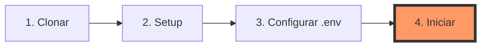
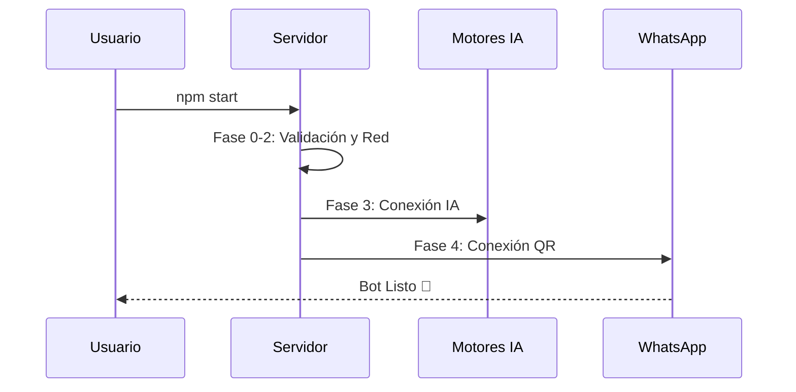

# 🦊 BotMaRe AI - Monolito Unificado v1.1.0

> **La navaja suiza de la automatización en WhatsApp.** Inteligencia Artificial, Dashboard Premium y Gestión de Tareas en un solo proceso ultra-eficiente.

---

## 💎 ¿Qué hace a BotMaRe único?

BotMaRe no es solo un bot; es una **infraestructura completa** diseñada para funcionar 24/7 sin complicaciones.

*   **🧠 Inteligencia Multi-Cerebro**: Conexión nativa con **DeepSeek**, Groq, Gemini y OpenAI. Si una falla, el bot puede rotar automáticamente.
*   **🎨 Dashboard de Cristal**: Interfaz web moderna (Glassmorphism) construida con Next.js 15 para monitorear todo en tiempo real.
*   **⚙️ Monolito Unificado**: Olvídate de abrir 3 terminales. El motor y la web corren juntos en un solo puerto (**8000**).
*   **🛡️ Seguridad de Grado Industrial**: Protección por contraseña, túneles seguros y aislamiento total de sesiones.

---

## 🛠️ Guía de Inicio Rápido



### 1. Clonar e Instalar
```bash
git clone https://github.com/LedezmaSune/BotMaRe.git
cd BotMaRe
npm run setup
```

### 2. Configurar "Las Llaves"
Crea tu archivo `.env` y rellena tus API Keys (puedes usar solo una o todas):
```bash
# El comando 'setup' ya creó el archivo .env por ti. 
# Solo ábrelo y pon tus llaves de DeepSeek, Groq o Gemini.
```

### 3. ¡Despegar!
```bash
npm start
```
*Si es tu primera vez, el bot detectará que falta la interfaz y la **compilará automáticamente** por ti.*

---

## 🌍 Despliegue en Cualquier Sistema

| Entorno | Método Recomendado | Comando |
| :--- | :--- | :--- |
| **🏠 Tu PC (Windows/Mac)** | Local / NPM | `npm start` |
| **☁️ VPS (Ubuntu/Debian)** | PM2 (Fondo) | `npm run pm2:start` |
| **🐋 Servidor Docker** | Contenedor | `docker-compose up -d` |
| **🌐 Acceso Remoto** | Cloudflare Tunnel | `npm run tunnel` |

---

## 🏗️ El Ciclo de Vida (Fases de Arranque)



Cuando inicias BotMaRe, el motor atraviesa estas etapas para garantizar estabilidad:

1.  **Fase 0 - Entorno**: Verifica que tengas tus llaves y carpetas listas.
2.  **Fase 1 - Memoria**: Se despierta la base de datos **SQLite**.
3.  **Fase 2 - Red**: Prepara los túneles de acceso externo.
4.  **Fase 3 - Lógica**: Carga los modelos de IA y el bot de Telegram.
5.  **Fase 4 - Motor**: Enciende el servidor web y conecta con **WhatsApp**.

---

## 🧰 Caja de Herramientas (Comandos NPM)

| Comando | 🦊 Función |
| :--- | :--- |
| `npm run setup` | Instalación limpia y creación de `.env`. |
| `npm run build` | Re-compila el Dashboard manualmente. |
| `npm run reset:wa` | **Botón de pánico**: Borra la sesión y genera nuevo QR. |
| `npm run pm2:logs` | Mira qué está pasando en tu VPS en tiempo real. |
| `npm run clean` | Borra archivos temporales para liberar espacio. |

---

## 🛡️ Checklist de Seguridad Pro
- [ ] Cambia la `DASHBOARD_PASS` en tu `.env`.
- [ ] No compartas nunca el archivo `.env`.
- [ ] Usa `npm run tunnel` si no sabes abrir puertos en tu router.

---

## 🆘 Solución de Problemas Comunes

### Error: `EISDIR` / `readlink` (en discos externos)
Si instalas el bot en un disco externo (D:, E:, etc.) formateado en **exFAT**, verás errores de `readlink`. 
**Solución**:
1. Mueve el proyecto al disco **C:** (NTFS).
2. O ejecuta: `git config --global core.symlinks false`, borra `node_modules` y haz `npm install` de nuevo.

### La terminal se cierra sola
Asegúrate de haber corrido `npm run setup` primero para crear el archivo `.env`. Sin ese archivo, el bot no arrancará.

### Fallo en la conexión de WhatsApp
Si ves el error `Timed Out` al conectar, revisa tu conexión a internet o usa `npm run reset:wa` para limpiar la sesión y escanear el QR de nuevo.

---

<p align="center">
  Hecho con ❤️ por <strong><a href="https://github.com/LedezmaSune">LedezmaSune</a></strong><br/>
  <em>"Automatizando el futuro, un mensaje a la vez."</em>
</p>
