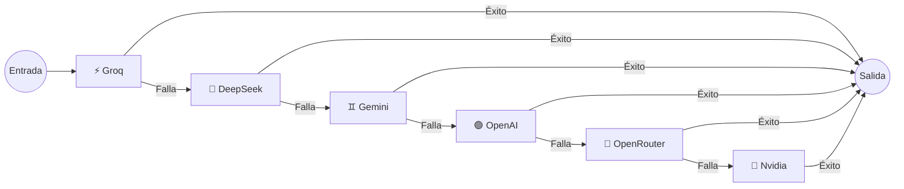

<div align="center">
  
  <h1>🦊 BotMaRe - Dashboard</h1>
  <p><strong>La plataforma definitiva de automatización para WhatsApp impulsada por Inteligencia Artificial y Orquestación Multi-Proveedor.</strong></p>

  <p>
    
    
    
    
    
  </p>
  <p>
    <i>Automatiza, difunde y responde como un humano 24/7.</i>
  </p>
</div>

<br />

> **BotMaRe (powered by Kitsune Engine)** transforma tu cuenta de WhatsApp en una central de operaciones inteligente. Integra modelos de IA, flujos de automatización, programadores de recordatorios, y un panel de administración premium (_Glassmorphism_), todo en un proceso monolítico de alto rendimiento.

---

<details open>
<summary><h2>📑 Tabla de Contenidos</h2></summary>

1. [✨ Características Principales](#-características-principales)
2. [📘 Manual de Usuario](#-manual-de-usuario-dashboard-y-funciones)
3. [🧠 Orquestador de IA](#-orquestador-de-ia-y-failover-automático)
4. [🚀 Instalación y Despliegue](#-guías-de-instalación-paso-a-paso)
5. [🛠️ Gestión Avanzada (PM2)](#-gestión-avanzada-con-pm2)
6. [⚠️ Troubleshooting](#-solución-a-errores-comunes)
7. [📶 Redes y Base de Datos](#-redes-y-base-de-datos)
8. [🔄 Changelog](#-historial-de-actualizaciones-changelog)

</details>

---

## ✨ Características Principales

| Característica              | Descripción                                                                      |
| :-------------------------- | :------------------------------------------------------------------------------- |
| 🧠 **IA Multi-Proveedor**   | Groq, Gemini, OpenAI, DeepSeek, OpenRouter y Nvidia con Failover automático.     |
| 📱 **WhatsApp Agent**       | Comprensión de imágenes (Visión), transcripción de audio (Whisper) y documentos. |
| 📢 **Difusión con Spintax** | Campañas masivas con giro de texto anti-spam asistidas por IA.                   |
| 📅 **Recordatorios**        | Programación inteligente masiva en chats privados y grupales.                    |
| 🛡️ **Blindaje Anti-Ban**    | Retardos proporcionales, pausas y simulación humana ("Escribiendo...").          |
| 👤 **Soporte Híbrido**      | Apaga la IA temporalmente para tomar control manual. Alertas vía Telegram.       |
| 📦 **Sincronización**       | Conexión web con Google Sheets para auto-respuestas y gestión de plantillas.     |

---

## 📘 Manual de Usuario (Dashboard y Funciones)

<details>
<summary><b>🤖 El Asistente Inteligente (Carga Masiva)</b></summary>
<br>
La joya de la corona para programar envíos.

1. Ve a **Recordatorios / Programación > Carga Masiva**.
2. **Configura la Campaña:** Destinatario, hora de envío, y usa `{ARCHIVO}` en tu mensaje.
3. **Nombra los archivos:** Usa la fecha (ej. `1105.jpg` para el 11 de Mayo).
4. El sistema agendará todo automáticamente en _Pendientes_.
</details>

<details>
<summary><b>📢 Difusiones y Motor Spintax</b></summary>
<br>
Para evitar baneos al enviar a cientos de personas, usa la sintaxis `{Opción 1|Opción 2}`. El bot elegirá una frase al azar para cada contacto.

**Botones de IA en el Panel:**

- **Perfeccionar:** Mejora ortografía y semántica.
- **Generar Spintax:** Crea variaciones anti-spam (puedes proteger palabras clave envolviéndolas en llaves `{texto inamovible}`).
</details>

<details>
<summary><b>🧠 Variables Dinámicas y Cerebro IA</b></summary>
<br>
Usa variables en tus plantillas que se rellenarán automáticamente: `{NOMBRE}`, `{NOMBRE_PILA}`, `{SALUDO}` (cambia según la hora), `{EMOJI_SALUDO}`, `{EMOJI_ATENCION}`, `{HORA_12}`, `{DIA_SEMANA}`, `{NUMERO_ALEATORIO}`.

- **IA ON (Verde):** El bot atiende automáticamente.
- **IA OFF (Naranja):** Pausa la IA para intervención humana.
</details>

---

## 🧠 Orquestador de IA y Failover Automático

La función `callLLM` asegura que si una API (ej. Llama en Groq) se cae o agota el saldo, se conmute a la siguiente de manera transparente en milisegundos.



---

## 🚀 Guías de Instalación Paso a Paso

<details open>
<summary><b>💻 Instalación Automática (Clientes)</b></summary>
<br>
Requiere <b>Docker Desktop</b> instalado en tu máquina.
Abre tu terminal y ejecuta:

**Windows:**

```powershell
mkdir BotMaRe; cd BotMaRe
Invoke-WebRequest -Uri "https://raw.githubusercontent.com/LedezmaSune/BotMaRe/main/ejemplo_cliente/docker-compose.yml" -OutFile "docker-compose.yml"
Invoke-WebRequest -Uri "https://raw.githubusercontent.com/LedezmaSune/BotMaRe/main/.env.example" -OutFile ".env"
```

**Mac/Linux:**

```bash
mkdir BotMaRe; cd BotMaRe
curl -O https://raw.githubusercontent.com/LedezmaSune/BotMaRe/main/ejemplo_cliente/docker-compose.yml
curl -o .env https://raw.githubusercontent.com/LedezmaSune/BotMaRe/main/.env.example
```

1. Edita el archivo `.env` para establecer tu propia contraseña segura.
2. Arranca con: `docker compose up -d`.
3. Accede a `http://localhost:8000`.
</details>

<details>
<summary><b>🖥️ Compilación Manual (Sin Docker)</b></summary>
<br>

- **Windows:** Ejecuta el archivo `install-windows.bat`.
- **Linux/VPS:** Ejecuta `curl -fsSL https://raw.githubusercontent.com/LedezmaSune/BotMaRe/main/install.sh | bash`
- **Android Termux:** Ejecuta `curl -fsSL https://raw.githubusercontent.com/LedezmaSune/BotMaRe/main/install-termux.sh | bash`
</details>

---

## 🛠️ Gestión Avanzada con PM2

Mantén el bot 24/7 en tu servidor (VPS).

- **Preparar:** `npm run setup`
- **Iniciar:** `pnpm run pm2:start`
- **Ver Logs:** `pnpm run pm2:logs`
- **Detener:** `pnpm run pm2:stop`

> [!TIP]
> **Mantenimiento:** Para optimizar y liberar espacio de registros viejos, usa `pnpm run clean:logs`.

---

## ⚠️ Solución a Errores Comunes

Si vienes de versiones antiguas o usas **PNPM v10+** y experimentas errores de compilación por falta de binarios nativos:

- Base de datos: `pnpm rebuild better-sqlite3`
- Túneles: `pnpm rebuild cloudflared`

> [!IMPORTANT]
> **Guía Completa de Errores de Windows / Node v24:** Si experimentas errores de tipo `EPERM`, `spawn`, o código `3221225477` (violación de acceso), consulta la guía detallada de diagnóstico en: [TROUBLESHOOTING.md](./TROUBLESHOOTING.md).

---

## 📶 Redes y Base de Datos

- **Conectividad Múltiple:** Soporte nativo para Red Local, **Tailscale VPN** (Privada), y **Cloudflare Tunnel** (Pública). Copia tus enlaces directo desde el dashboard.
- **Base de Datos Híbrida:** Prioridad a **MongoDB Atlas** (Nube). Si se cae la red, conmuta automáticamente a **Lowdb** (Local sin pérdida de datos).

---

<details>
<summary><b>🔄 Historial de Actualizaciones (Changelog)</b></summary>
<br>

- **[2.0.0] - 2026-07-04:** Actualización Enterprise: Soporte Docker, Respaldos diarios encriptados (Telegram), CRM con Etiquetas, Handoff/Pausa de IA, y envíos nativos de Notas de Voz reales (PTT).
- **[1.5.6] - 2026-06-18:** Fix para PNPM v10, instaladores mágicos (`.bat` y `.sh`), reparación de túneles en Windows.
- **[1.5.0] - 2026-06-14:** Rediseño CLI con arte ANSI, mejoras Sheets 3 columnas.
- **[1.4.0] - 2026-06-04:** Motor de Spintax, asistencia IA, simulación multimedia anti-ban.
</details>

---

<div align="center">
  <p>Desarrollado con ❤️ por <strong><a href="https://github.com/LedezmaSune">LedezmaSune</a></strong> | Impulsado por <strong>Kitsune Engine</strong> 🦊</p>
</div>
