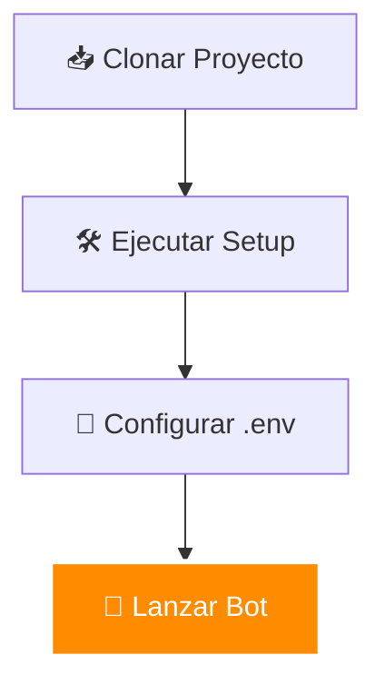
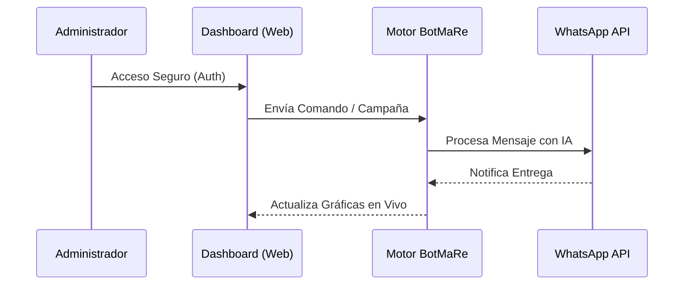

<p align="center">
  
</p>

<p align="center">
  
  
  
  
</p>

<h1 align="center">🦊 BotMaRe AI</h1>

<p align="center">
  <strong>La navaja suiza de la automatización en WhatsApp.</strong><br/>
  Inteligencia Artificial, Dashboard Premium y Gestión Profesional en un solo proceso ultra-eficiente.
</p>

---

## 💎 Características de Élite

BotMaRe no es solo un bot; es una **infraestructura modular de grado empresarial** diseñada para el siglo XXI.

*   **🧠 Inteligencia Híbrida**: Rota automáticamente entre **DeepSeek**, Groq, Gemini y OpenAI. ¡Nunca te quedarás sin respuestas!
*   **🎨 Dashboard de Cristal**: Interfaz web ultra-moderna con **Glassmorphism**, gráficas en tiempo real y gestión de campañas masivas.
*   **🛡️ Escudo de Seguridad**: Integración nativa con **Helmet.js**, **Rate Limiting** (anti-fuerza bruta) y auditoría de accesos en tiempo real.
*   **⚡ Despliegue Inteligente**: Archivos `.bat` de un solo clic para Windows y configuración de **PM2** auto-detectable para servidores Linux/VPS.
*   **🌍 Acceso Global**: Túneles de **Cloudflare** integrados para acceder a tu bot desde cualquier parte del mundo de forma segura.

---

## 🚀 Guía de Inicio Relámpago



### 1. Preparación en 30 segundos
```bash
git clone https://github.com/LedezmaSune/BotMaRe.git
cd BotMaRe
npm run setup
```

### 2. Configuración
Abre el archivo `.env` que se creó automáticamente y rellena tus API Keys. ¡Puedes usar solo una o todas!

### 3. ¡Despegue!
- **Para desarrollo:** `npm start`
- **Para producción (Recomendado):** Usa el archivo `LANZAR_BOT.bat` o ejecuta `npm run pm2:start`.

---

## 🛡️ Nueva Capa de Seguridad "Fortified"
Hemos elevado los estándares de seguridad para proteger tu información:

*   **Anti-Brute Force:** Bloqueo automático de IPs tras múltiples intentos fallidos.
*   **HTTP Security Headers:** Protección contra XSS, Clickjacking y Sniffing vía Helmet.
*   **Real-time Audit:** Registro inmediato de intentos de acceso sospechosos en la consola.
*   **Trust Proxy:** Detección precisa de la ubicación del usuario incluso detrás de túneles.

---

## 📊 Arquitectura de Operaciones



---

## 🧰 Comandos de Poder (NPM)

| Comando | Acción |
| :--- | :--- |
| `npm run setup` | Instalación total y creación de entorno. |
| `npm run pm2:start` | Lanza el bot en segundo plano (Modo Servidor). |
| `npm run reset:wa` | **Reset Maestro**: Limpia la sesión para un nuevo QR. |
| `npm run pm2:monit` | Panel visual de rendimiento en tiempo real. |
| `npm run build` | Compila manualmente la interfaz del dashboard. |

---

## 🆘 ¿Algo no funciona?

### Errores de Disco (exFAT/Externos)
Si usas un disco externo, ejecuta: `git config --global core.symlinks false` antes de instalar.

### El Dashboard no carga
Asegúrate de que el puerto **8000** esté libre o cámbialo en el `.env`. Si usas Cloudflare, verifica que `npm run tunnel` esté activo.

---

<p align="center">
  Hecho con ❤️ por <strong><a href="https://github.com/LedezmaSune">LedezmaSune</a></strong><br/>
  <em>"Elevando la automatización al siguiente nivel."</em>
</p>
