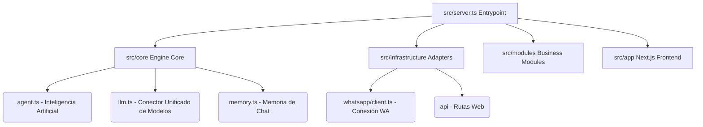

# 🦊 BotMaRe AI - Ecosistema Modular Avanzado de WhatsApp 🚀

¡Hola y bienvenido a la documentación de **BotMaRe AI 2026**! 🎉 
Esta es la plataforma definitiva diseñada para transformar tu WhatsApp en un centro de operaciones inteligente. Imagina que pudieras tener a un asistente experto trabajando para ti en WhatsApp las 24 horas del día. 

El sistema está construido bajo una arquitectura limpia y eficiente: cuenta con un motor robusto (Backend) desarrollado en Node.js y un panel de control (Dashboard) hermoso y moderno construido con Next.js y React. ¡Está diseñado para nunca detenerse!

---

## ⚡ La Vía Rápida: Instalación Exprés (Solo Linux/macOS)

Si tienes un servidor o computadora con Linux o macOS y quieres la forma más rápida y automática de instalar todo, ¡esta es tu opción! Solo abre tu terminal y pega esta línea:

```bash
curl -fsSL https://raw.githubusercontent.com/LedezmaSune/BotMaRe/main/install.sh | bash
```

> [!TIP]
> **¿Qué hace este comando mágico?** Descarga el código, instala Node.js (si te falta), prepara todas las herramientas, configura tu memoria y compila el panel visual. **Cero interacción requerida de tu parte.** ¡Tú solo relájate! ☕

Una vez que termine, solo te faltará poner tus claves de Inteligencia Artificial:
```bash
cd BotMaRe
nano .env              # Pon aquí tus claves de IA (Gemini, OpenAI, etc.)
pnpm run pm2:start     # ¡Enciende el bot en modo 24/7!
```

---

## 📋 ¿Qué necesitas antes de empezar? (Requisitos)

Antes de meter las manos en la masa, asegúrate de tener estas herramientas:

| Herramienta | Versión Mínima | ¿Para qué sirve? |
|---|---|---|
| **Node.js** | v20 LTS | [Descargar](https://nodejs.org/) — Es el motor principal que hace funcionar el bot. |
| **Git** | Cualquiera | [Descargar](https://git-scm.com/) — Nos permite descargar y actualizar el código fácilmente. |
| **pnpm** | v9+ | Instala las piezas (librerías) que necesita el bot mucho más rápido. |
| **PM2** | v5+ | Es nuestro administrador: se asegura de que el bot siga corriendo aunque cierres la consola. |

---

## 🚀 Guía de Instalación Detallada (Paso a Paso)

Si prefieres tener control total del proceso o estás en **Windows**, no te preocupes, aquí te llevamos de la mano:

### 🪟 Si estás en Windows

¡BotMaRe funciona perfecto en Windows! 

> **💡 ¿Cómo usar `curl` en Windows?**
> En Windows 10 (actualizado) o Windows 11, `curl` ya viene preinstalado. Abre tu Símbolo del Sistema (CMD) o PowerShell y úsalo igual que en Linux.
> *⚠️ Nota para usuarios de PowerShell:* Escribe `curl.exe` en lugar de solo `curl` para evitar conflictos con comandos internos de Windows.

Sigue estos pasos en tu consola (CMD):

1. **Descarga el código:**
   ```cmd
   git clone https://github.com/LedezmaSune/BotMaRe.git
   cd BotMaRe
   ```
2. **Ejecuta el asistente visual:**
   ```cmd
   bin\setup.bat
   ```
   *Esto abrirá un menú interactivo que te guiará instalando todo lo necesario.*
   *(Nota: También tienes `bin\manager.bat`, que es un panel de control completo para manejar tu bot en Windows).*

### 🐧 Si estás en Linux / macOS (Instalación Interactiva)

Si quieres ver qué hace el instalador paso a paso en tu Linux/Mac:

```bash
# 1. Descargamos el código
git clone https://github.com/LedezmaSune/BotMaRe.git
cd BotMaRe

# 2. Ejecutamos el instalador paso a paso
chmod +x install.sh
./install.sh
```
El asistente te hará un par de preguntas y configurará todo a tu gusto.

### 🔧 Instalación 100% Manual (Para los más técnicos)

Si eres de los que les gusta armar los muebles sin leer el manual, aquí tienes los comandos crudos:

```bash
git clone https://github.com/LedezmaSune/BotMaRe.git
cd BotMaRe
npm install -g pnpm pm2
pnpm config set ignore-scripts false
pnpm install
# Linux/Mac: cp .env.example .env | Windows: copy .env.example .env
nano .env # (Edita tus claves)
pnpm run build
pnpm run pm2:start
```

---

## ⚙️ Configurando los Secretos (El archivo `.env`)

El bot necesita algunos secretos para funcionar. Abre o crea el archivo llamado `.env` y asegúrate de tener esto configurado:

```env
# ── SEGURIDAD DEL DASHBOARD (Inventa tu usuario y clave) ──
DASHBOARD_USER=mi_usuario_seguro
DASHBOARD_PASS=mi_clave_super_secreta

# ── PUERTO (Donde vivirá tu panel web) ──
PORT=8000

# ── INTELIGENCIA ARTIFICIAL (Obligatorio poner al menos 1) ──
GEMINI_API_KEY=tu_clave_de_gemini_aqui
# También puedes usar OPENAI_API_KEY, DEEPSEEK_API_KEY, etc.

# ── TELEGRAM (Opcional, para controlar el bot desde Telegram) ──
TELEGRAM_BOT_TOKEN=tu_token_aqui
TELEGRAM_ALLOWED_USER_IDS=tu_id_numerico
```

---

## 🎮 ¡A Jugar! (Modos de Encendido)

Dependiendo de lo que quieras hacer, puedes encender tu bot de diferentes formas:

| Comando | ¿Qué hace? | ¿Cuándo usarlo? |
|---|---|---|
| `pnpm run pm2:start` | **Producción 24/7 (Recomendado)** | Cuando quieres dejar el bot funcionando de fondo, seguro y reiniciándose solo. |
| `pnpm run start` | **Producción Simple** | Para encenderlo directamente en la consola (si cierras la consola, se apaga). |
| `pnpm run dev` | **Modo Desarrollo** | Si vas a modificar el código. Los cambios se ven en vivo. |

### 🛠️ Comandos Útiles de PM2 (El Administrador)
Si encendiste tu bot con `pm2:start`, estos comandos te servirán:
*   `pnpm run pm2:logs` : Muestra todo lo que está haciendo el bot en tiempo real.
*   `pnpm run pm2:stop` : Pausa el bot.
*   `pnpm run pm2:restart` : Reinicia el bot (útil si hiciste cambios).
*   `pnpm run pm2:monit` : Abre un monitor visual para ver cuánta memoria y CPU usa el bot.

### 📱 Primer Uso: Conectando WhatsApp
1. Abre tu navegador web y entra a `http://localhost:8000` (o la IP de tu servidor si está en la nube).
2. Entra con el usuario y contraseña que pusiste en el archivo `.env`.
3. Ve a la sección de WhatsApp. Verás un gran código QR.
4. Toma tu celular, abre WhatsApp, ve a **Dispositivos Vinculados > Vincular** y escanea ese QR. ¡Listo! 🥳

---

## 🔄 ¿Cómo Actualizar el Bot?

Cuando saquemos nuevas mejoras, actualizar es facilísimo:

**En Linux / macOS:**
```bash
chmod +x update.sh && ./update.sh
```

**En Windows:**
```cmd
bin\actualizar.bat
```

*(El sistema hará un respaldo de tus datos y `.env` automáticamente antes de actualizar por seguridad).*

---

## 📂 ¿Cómo está estructurado el código?

Para los desarrolladores, aquí está el mapa de cómo funciona BotMaRe por dentro:



| Directorio / Archivo | ¿Qué hace? |
|---|---|
| `src/server.ts` | El corazón. Inicia la web, los bots y las tareas programadas. |
| `src/app/` | Toda la interfaz web hermosa hecha en Next.js. |
| `src/core/` | Los cerebros de la IA, memoria y conexiones seguras. |
| `src/infrastructure/` | La conexión pura y dura con WhatsApp (Baileys) y bases de datos. |
| `data/` y `backups/` | Donde se guardan tus bases de datos y respaldos. |
| `bin/` | Scripts mágicos para que Windows funcione perfecto. |

---

## 🖥️ Requisitos para Servidores (Si lo subes a la nube)

Si vas a instalar BotMaRe en un VPS (Servidor Privado Virtual), esto es lo que necesitas:

| | 🔴 Mínimo | 🟢 Recomendado (¡Ideal!) |
|---|---|---|
| **CPU** | 1 vCPU | 2+ vCPUs |
| **RAM** | 1 GB (+ Memoria Swap 2 GB) | 2+ GB de RAM |
| **Disco** | 10 GB SSD | 20+ GB SSD o NVMe |

> [!IMPORTANT]
> **El Truco del Swap (Muy importante):** Si tu servidor tiene solo 1 GB de RAM, la compilación de la página web podría fallar por falta de memoria. Nuestro script `install.sh` te ofrece crear "Swap" (memoria virtual) automáticamente. ¡Dile que sí!

### Preparando un servidor Ubuntu/Debian desde cero
Si usas nuestro instalador rápido no tienes que hacer esto, pero si lo haces manual, estos son los pasos para preparar tu Linux:

```bash
sudo apt update && sudo apt upgrade -y
sudo apt install build-essential python3 make g++ git curl -y
# Instalar Node 20
curl -fsSL https://deb.nodesource.com/setup_20.x | sudo -E bash -
sudo apt install -y nodejs
sudo npm install -g pnpm pm2
```

---

## 🆘 Primeros Auxilios (Problemas Frecuentes)

¡A todos nos pasa! Aquí tienes las soluciones a los tropiezos comunes:

### 1. El QR no carga o se quedó trabado
> [!CAUTION]
> A veces WhatsApp se marea. Escribe en tu consola `pnpm run reset:wa`. Esto borrará la sesión de WhatsApp y te dará un QR completamente nuevo y fresco al recargar la página web.

### 2. Error de Puerto en uso ("EADDRINUSE")
> [!IMPORTANT]
> El puerto 8000 ya está ocupado. Abre tu `.env`, cambia `PORT=8000` por otro (como `8500`) y reinicia.

### 3. Error en Git: "Dubious Ownership" (Dueño dudoso)
> [!NOTE]
> Pasa en Windows si el usuario que clonó es diferente al que ejecuta. Escribe esto:
> `git config --global --add safe.directory /ruta/hacia/tu/carpeta/BotMaRe`

### 4. Error al instalar la base de datos "Better-SQLite3"
> [!TIP]
> Esta base de datos necesita "compilarse" y a veces falla si faltan herramientas.
> Asegúrate de haber escrito `pnpm config set ignore-scripts false` antes de instalar, y luego intenta forzarlo con `pnpm rebuild better-sqlite3`.

### 5. La página web sale en blanco (out/index.html no encontrado)
> [!WARNING]
> Intentaste encender el bot en producción pero te faltó "fabricar" la web. Escribe `pnpm run build` en tu consola y vuelve a intentarlo.

---

© 2026 **BotMaRe AI** - Potenciando la comunicación inteligente y la automatización del futuro.
*Diseñado y optimizado con ❤️ para mentes innovadoras.*
