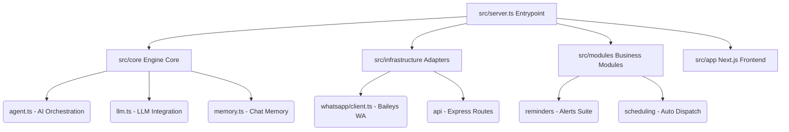

# 🦊 BotMaRe AI - Ecosistema Modular Avanzado de WhatsApp 🚀

¡Bienvenido a la documentación de **BotMaRe AI 2026**! Esta es la plataforma definitiva diseñada para transformar tu WhatsApp en un centro de operaciones inteligente, altamente portátil y con rendimiento de grado empresarial.

El sistema ha sido estructurado bajo una arquitectura de **Monolito Modular** limpia y eficiente. Cuenta con un robusto motor backend desarrollado en Node.js/Express y una interfaz moderna (Dashboard) construida con **Next.js 16 (React 19)** y animaciones de `framer-motion`, lista para ejecutarse 24/7 de manera ininterrumpida.

---

## 📂 Estructura General del Proyecto (Detallada)

La arquitectura modular del proyecto divide las responsabilidades claramente para facilitar el mantenimiento, la extensibilidad y el desarrollo multiplataforma:

### 1. 📁 Directorio Raíz (Root)
*   `src/` ➔ El código fuente del proyecto, el cual engloba tanto el motor backend como las vistas del frontend.
*   `data/` ➔ Almacenamiento persistente local. Contiene bases de datos SQLite locales (`database.db`), registros de auditoría y archivos multimedia temporales. *(Ignorado en Git por seguridad)*.
*   `backups/` ➔ Respaldos periódicos de bases de datos y configuraciones. *(Ignorado en Git)*.
*   `.env` ➔ Configuración confidencial del sistema, claves de API, puertos y credenciales de seguridad. *(Ignorado en Git)*.
*   `.gitignore` ➔ Reglas de exclusión para evitar la subida de datos privados, cachés o scripts locales al repositorio de GitHub.
*   `package.json` ➔ Define las dependencias del proyecto (Next.js, Baileys, Better-SQLite3, Socket.io) y comandos de script estándar.
*   `ecosystem.config.js` ➔ Orquestación de procesos en segundo plano a través del gestor de producción **PM2**.
*   `Dockerfile` & `docker-compose.yml` ➔ Archivos listos para contenedorizar y desplegar la aplicación mediante Docker.

---

### 2. 📁 Arquitectura del Código Fuente (`src/`)
La lógica de negocio está dividida siguiendo estrictos principios de desacoplamiento modular:


*   `src/server.ts` ➔ **Punto de Entrada del Servidor**. Inicializa las variables, verifica los directorios del sistema, levanta Express con Socket.io para comunicación bidireccional en tiempo real, e inicializa el túnel de red, los planificadores y los bots de WhatsApp y Telegram.
*   `src/app/` ➔ La interfaz de Next.js (Dashboard). Desarrollado con el nuevo paradigma de App Router.
*   `src/core/` ➔ El núcleo del agente autónomo:
    *   `agent.ts` ➔ Controlador del Agente de Inteligencia Artificial.
    *   `llm.ts` ➔ Adaptador y proveedor unificado de modelos de lenguaje (OpenAI, Gemini, Claude, DeepSeek).
    *   `memory.ts` ➔ Administrador de memoria conversacional y reducción inteligente de tokens de historial.
    *   `tunnel.ts` ➔ Creación nativa de túneles remotos seguros con Cloudflare Tunneling.
*   `src/modules/` ➔ Módulos independientes de negocio:
    *   `reminders/` ➔ Sistema avanzado de avisos, alertas y recordatorios de eventos.
    *   `scheduling/` ➔ Motor de despachado programado, control de colas y jitter para evitar bloqueos.
    *   `templates/` ➔ Gestor de plantillas de texto y contenido multimedia.
*   `src/infrastructure/` ➔ Adaptadores externos:
    *   `whatsapp/client.ts` ➔ Cliente de automatización y comunicación WhatsApp construido con la librería Baileys.
    *   `whatsapp/sqlite-auth.ts` ➔ Almacenamiento optimizado de las credenciales del QR en base de datos SQLite.
*   `src/telegram/` ➔ Suite del bot de Telegram para administración remota y servicio de notificaciones en tiempo real.

---

## 🚀 Pasos para la Instalación y Puesta en Marcha (Lentamente)

Sigue estos pasos con atención para instalar y ejecutar el bot en cualquier sistema operativo (Windows, Linux, macOS o servidores en la nube).

### 📋 Requisitos Previos
Asegúrate de contar con lo siguiente instalado en tu máquina:
1.  **Node.js (v20 o superior)** ➔ [Sitio Oficial](https://nodejs.org/).
2.  **Git** (para clonar y actualizar código) ➔ [Sitio Oficial](https://git-scm.com/).
3.  **pnpm** (gestor de paquetes ultra-rápido recomendado). Si no lo tienes, puedes instalarlo globalmente ejecutando en tu terminal:
    ```bash
    npm install -g pnpm
    ```

---

### 💻 Guía de Despliegue Estándar (Multiplataforma)

#### Paso 1: Clonar el proyecto e ingresar a la carpeta
Abre la consola o terminal de tu sistema operativo y escribe:
```bash
git clone https://github.com/LedezmaSune/BotMaRe.git
cd BotMaRe
```

#### Paso 2: Instalar las dependencias
Para que el bot pueda compilar correctamente las librerías nativas de bases de datos, debemos habilitar los scripts de compilación e instalar:
```bash
pnpm config set ignore-scripts false
pnpm install
```

#### Paso 3: Configurar las Variables de Entorno (`.env`)
Debemos crear un archivo `.env` en la raíz del proyecto para indicarle al sistema tus credenciales. 
1.  Copia la plantilla de ejemplo:
    *   **En Windows (CMD):**
        ```cmd
        copy .env.example .env
        ```
    *   **En Linux / macOS / PowerShell:**
        ```bash
        cp .env.example .env
        ```
2.  Abre el archivo `.env` recién creado en un editor de texto y rellena los datos importantes:
    *   **Dashboard Security:** Define el usuario y clave para ingresar a la web:
        ```env
        DASHBOARD_USER=tu_usuario
        DASHBOARD_PASS=tu_clave_segura
        ```
    *   **Port:** Define el puerto de red (por ejemplo, `PORT=8000`).
    *   **Proveedores de IA:** Introduce tu API Key de tu proveedor preferido (ej: `GEMINI_API_KEY`, `OPENAI_API_KEY`, `DEEPSEEK_API_KEY`).
    *   **Telegram Admin (Opcional):** Si deseas control y reportes remotos, añade tu `TELEGRAM_BOT_TOKEN` y tu ID de usuario en `TELEGRAM_ALLOWED_USER_IDS`.

#### Paso 4: Compilar la Interfaz de Usuario (Frontend)
Next.js requiere construir la aplicación estática optimizada para producción:
```bash
pnpm run build
```
*(Este comando limpiará las cachés antiguas de construcción y generará una carpeta `out/` optimizada y lista para ser servida).*

#### Paso 5: Arrancar el Ecosistema
Elige el modo en el que deseas ejecutar la aplicación según tu entorno:

##### A) Modo Desarrollo (Con recarga en vivo, ideal para pruebas)
```bash
pnpm run dev
```
*(Inicia concurrentemente el servidor del Backend en el puerto 8000 y el servidor del Frontend en el puerto 3000 con recarga en vivo al editar código).*

##### B) Modo Producción Local
```bash
pnpm run start
```
*(Compila en caso de no haberlo hecho y levanta la aplicación unificada sirviendo los archivos estáticos en el puerto configurado en tu `.env` de forma directa y súper veloz).*

##### C) Modo Producción 24/7 (Gestionado con PM2)
Para un despliegue serio en servidores VPS o servidores locales que requieran auto-reinicio ante caídas y control en segundo plano:
1.  Instala PM2 globalmente:
    ```bash
    npm install -g pm2
    ```
2.  Inicia la aplicación:
    ```bash
    pnpm run pm2:start
    ```
3.  **Comandos útiles de mantenimiento para PM2:**
    *   `pnpm run pm2:logs` ➔ Muestra la salida y registros de la aplicación en tiempo real.
    *   `pnpm run pm2:stop` ➔ Detiene de forma segura la ejecución del bot en segundo plano.
    *   `pnpm run pm2:restart` ➔ Reinicia el motor por completo.
    *   `pnpm run pm2:delete` ➔ Elimina los procesos del monitor de PM2.

#### Paso 6: Escanear Código QR y Vincular
1.  Abre tu navegador de preferencia e ingresa a: `http://localhost:8000` (o a la dirección IP de tu servidor).
2.  Escribe el usuario y la contraseña configurados en tu archivo `.env`.
3.  Dirígete a la sección de conexión de WhatsApp, espera a que se genere el código QR y escanéalo con tu dispositivo móvil desde **WhatsApp ➔ Dispositivos vinculados**.

---

## 🆘 Solución a Problemas Frecuentes y Errores Comunes

### 1. Error de permisos en Git ("Dubious Ownership")
> [!NOTE]
> **Causa:** Ocurre comúnmente en Windows al clonar repositorios si el propietario del archivo difiere del usuario de la sesión de consola activa.
>
> **Solución:** Ejecuta el siguiente comando para registrar el directorio local como seguro en Git:
> ```bash
> git config --global --add safe.directory c:/Proyectos/wamasivos/BotMaRe-main
> ```

### 2. Error: "Interfaz no compilada" o "out/index.html no encontrado"
> [!WARNING]
> **Causa:** Has intentado iniciar el bot en producción pero no se ha generado la carpeta de distribución del Dashboard de Next.js.
>
> **Solución:** Ejecuta el comando de compilación estática antes de arrancar:
> ```bash
> pnpm run build
> ```

### 3. Error: Incompatibilidad de compilación de Better-SQLite3
> [!TIP]
> **Causa:** La base de datos nativa SQLite requiere compilación C++ nativa y falló al instalarse de forma automática.
>
> **Solución:** 
> 1. Asegúrate de configurar los scripts de instalación de paquetes de node:
>    ```bash
>    pnpm config set ignore-scripts false
>    ```
> 2. Fuerza una reinstalación limpia:
>    ```bash
>    pnpm rebuild better-sqlite3
>    ```

### 4. Error: Puerto 8000 ya está siendo utilizado ("EADDRINUSE")
> [!IMPORTANT]
> **Causa:** Otra aplicación o un proceso zombie del mismo bot está ocupando el puerto de red.
>
> **Solución:** 
> *   **Opción A:** Abre tu `.env` y define otro puerto diferente, por ejemplo: `PORT=8500`.
> *   **Opción B (Matar proceso en Windows):**
>     ```cmd
>     netstat -aon | findstr :8000
>     taskkill /F /PID <PID_encontrado>
>     ```
> *   **Opción C (Matar proceso en Linux/macOS):**
>     ```bash
>     kill -9 $(lsof -t -i:8000)
>     ```

### 5. La sesión se quedó colgada o el QR no actualiza
> [!CAUTION]
> **Causa:** Las claves criptográficas de autenticación de WhatsApp en la base de datos local de SQLite o caché se corrompieron.
>
> **Solución:** Ejecuta el script de limpieza rápida para reiniciar el canal de WhatsApp a su estado original de fábrica:
> ```bash
> pnpm run reset:wa
> ```
> *(Esto detendrá la sesión de Baileys de forma limpia y eliminará las bases de datos de sesión. Al refrescar el Dashboard, aparecerá un código QR nuevo y limpio).*

---

© 2026 **BotMaRe AI** - Potenciando la comunicación inteligente y la automatización del futuro.
*Monolito Modular diseñado, optimizado y creado con ❤️ para mentes innovadoras.*
